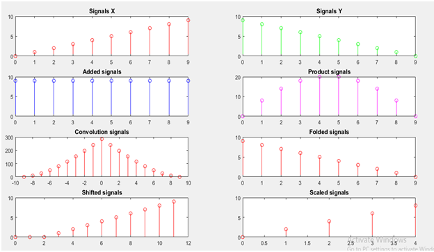
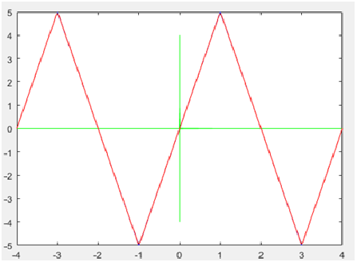
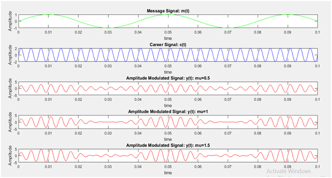
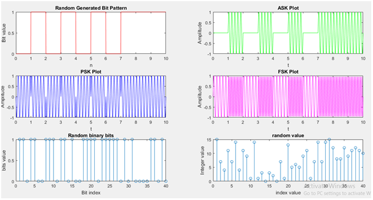
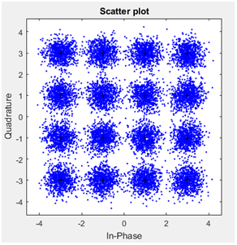
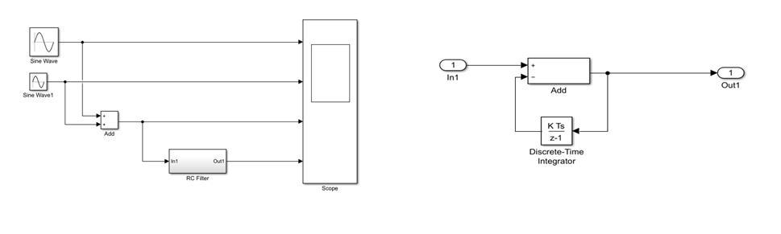
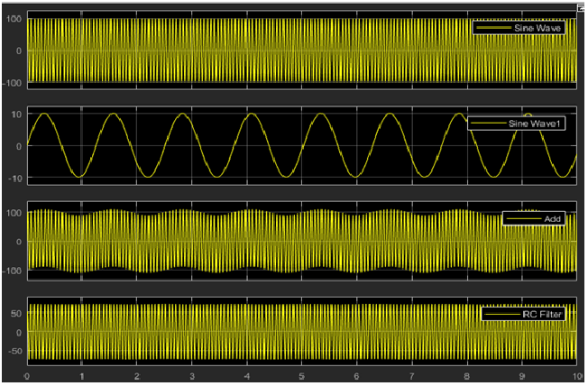
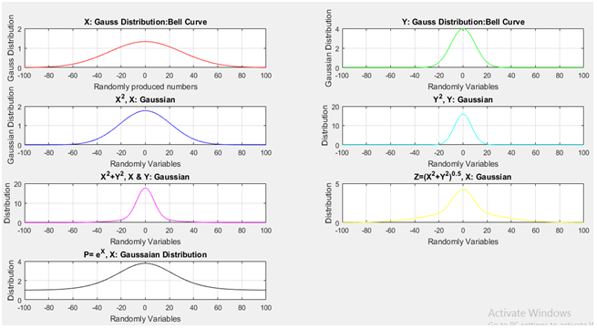
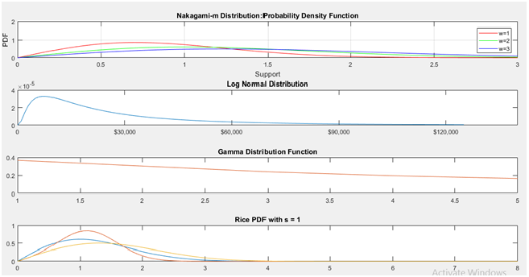
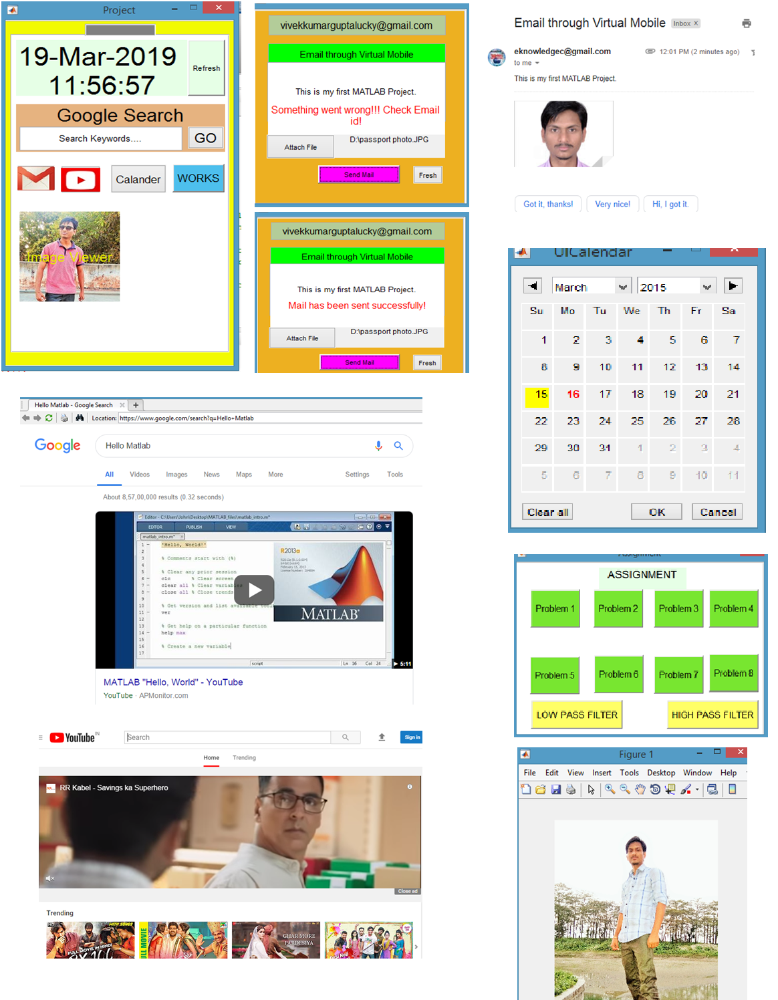

# MATLAB-projects-and-Assignments
This repository contains MATLAB related files. Here programming files is available from basic level to some advance level. Including that, two project implemented on MATLAB is also included.

***Here are some output images***
> **Some operations on singnals**

- 

> **Signal Plotting**

- 

> **Sgnal Modulations schemes**

- 

> **Digital Modulation Schemes**

- 

> **Quadrature shift keying**

- 

> **High Pass filter Design**

- __High pass filter______________________________________________________ __RC Filter(Internal Architecture)__

  - 
  
- __Visual Output__
  
  - 
 
> **Gaussian Distributions and operations on it**

- 

> **Some Famous Distributions**

- 

> **Project 2: Screenshots**

- 
